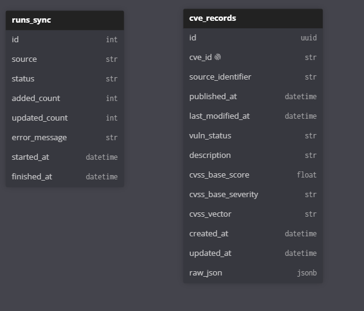

# CVE Vulnerability Tracker

Backend-сервис для загрузки, хранения, синхронизации и поиска CVE-уязвимостей.

Проект реализован в рамках практики. Основной источник данных — NVD API. Дополнительно реализована интеграция с OSV API
для поиска уязвимостей по package/version.

## Стек

- Python 3.13
- FastAPI
- PostgreSQL
- SQLAlchemy 2.0 Async
- Alembic
- APScheduler
- httpx
- Jinja2
- pytest / pytest-asyncio / pytest-cov
- Docker / Docker Compose

## Что реализовано

- Загрузка CVE из NVD API
- Первичная загрузка данных за период до 12 месяцев
- Ручной запуск recent sync через API
- Периодическая синхронизация через отдельный worker-процесс
- Таблица `sync_runs` со статусами запусков синхронизации
- Upsert CVE без дублей при повторной синхронизации
- Хранение affected products: vendor, product, version, cpe_uri
- Получение CVE по `cve_id`
- Список CVE с пагинацией
- Фильтры по severity, date range, vendor, product
- Endpoint статистики
- Интеграция с OSV API по ecosystem/package/version
- Единая структура ошибок
- Swagger UI
- Jinja2 web UI
- Логирование в консоль и файл
- Docker Compose конфигурация для backend, PostgreSQL и sync-worker
- Тесты с покрытием около 65%

## API endpoints

### CVE

- `GET /cve/` — список CVE с пагинацией и фильтрами
- `GET /cve/{cve_id}` — получение CVE по идентификатору

### Stats

- `GET /stats` — статистика по CVE

### Sync

- `GET /sync-runs/` — список запусков синхронизации
- `GET /sync-runs/{sync_run_id}` — получение sync run по ID
- `POST /sync-runs/nvd/recent` — ручной запуск recent NVD sync
- `POST /sync-runs/nvd/initial-load` — первичная загрузка NVD за период
- `POST /sync-runs/osv/package` — поиск OSV vulnerabilities по package/version

### Web UI

- `GET /ui/cve` — web-страница со списком CVE и фильтрами
- `GET /ui/cve/{cve_id}` — web-страница CVE detail
- `GET /ui/stats` — web-страница статистики

### Docs

- `GET /docs` — Swagger UI
- `GET /redoc` — ReDoc

## Переменные окружения

Пример `.env`:

```env
DATABASE_URL=postgresql+psycopg://postgres:admin@db:5432/cve_sync
ASYNC_DATABASE_URL=postgresql+asyncpg://postgres:admin@db:5432/cve_sync

POSTGRES_USER=postgres
POSTGRES_PASSWORD=admin
POSTGRES_DB=cve_sync

NVD_API_KEY=
NVD_BASE_URL=https://services.nvd.nist.gov/rest/json/cves/2.0
NVD_TIMEOUT_SECONDS=90
NVD_MAX_RETRIES=2
NVD_RETRY_SLEEP_SECONDS=10
NVD_RESULTS_PER_PAGE=2000
NVD_RECENT_SYNC_DAYS=1
NVD_INITIAL_LOAD_MONTHS=12
NVD_CHUNK_DAYS=7
NVD_SCHEDULER_INTERVAL_HOURS=24

OSV_BASE_URL=https://api.osv.dev
OSV_TIMEOUT_SECONDS=30
```

## Структура проекта

```
app/
  main.py                    # точка входа FastAPI-приложения

  api/                       # REST API routers
    cve.py
    stats.py
    sync.py
    errors.py
    exceptions.py

  clients/                   # клиенты внешних API
    nvd.py
    osv.py

  core/                      # настройки и логирование
    config.py
    logging.py

  db/                        # SQLAlchemy base, engine, session
    base.py
    database.py

  models/                    # ORM-модели
    cve.py
    sync.py

  normalizers/               # преобразование внешних данных к внутреннему формату
    nvd.py
    osv.py

  repositories/              # слой работы с БД
    cve.py
    stats.py
    sync.py

  schemas/                   # Pydantic-схемы
    cve.py
    error.py
    osv.py
    stats.py
    sync.py

  services/                  # бизнес-логика синхронизации
    nvd_sync.py
    osv_sync.py

  schedulers/                # планировщик периодического sync
    nvd_sync.py

  workers/                   # отдельные worker entrypoints
    nvd_sync.py

  web/                       # Jinja2 web UI router
    router.py

  templates/                 # HTML-шаблоны
  static/                    # CSS/static files

alembic/                     # миграции БД
tests/                       # тесты
docs/                        # дополнительная документация
```

## ER-диаграмма


